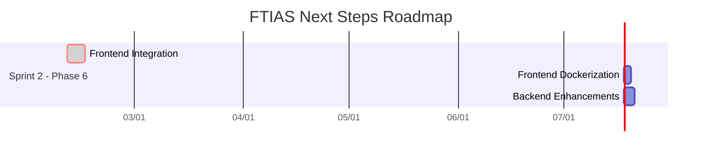

# FTIAS Development Roadmap: Next Steps

**Project:** Flight Test Interactive Analysis Suite (FTIAS)
**Date:** February 10, 2026
**Author:** Manus AI

---

## 1. Introduction

This document outlines the recommended timeline and sequence for the next phase of the FTIAS project. Based on the current state of the project—a robust, well-tested backend and a verified Docker environment—this roadmap is designed to ensure a smooth and efficient path toward a fully functional application.

We will explore the optimal sequence for the three main options:

1. **Frontend Integration**
2. **Frontend Dockerization**
3. **Backend Enhancements**

---

## 2. Recommended Timeline & Sequence

The most logical and efficient sequence for the next steps is as follows:

- **Step 1: Frontend Integration (Core Development)**

- **Why first?** This is the most critical next step to make the application usable. A functional user interface is necessary to interact with the powerful backend you've built. It provides immediate value and allows for early user feedback.

- **Step 2: Frontend Dockerization (Deployment Preparation)**

- **Why second?** Once the frontend has some basic functionality, it's important to ensure it can be deployed alongside the backend in a containerized environment. This step prepares the application for production and simplifies the development setup for new team members.

- **Step 3: Backend Enhancements (Continuous Improvement)**

- **Why third?** These tasks, while important, are not critical blockers for a functional application. They can be worked on in parallel or after the core application is functional. This includes increasing test coverage and adding new features.

### Visual Roadmap

---

## 3. Detailed Breakdown of Each Step

### **Step 1: Frontend Integration (5-7 Days)**

This is the most critical phase to bring your application to life. The goal is to create a user interface that can communicate with your backend API.

**Key Tasks:**

1. **Project Setup:**
   - Initialize a new React application in the `frontend/` directory using a tool like Vite (`npm create vite@latest . -- --template react-ts`).
   - Install necessary dependencies: `axios` for API requests, `react-router-dom` for navigation, and a UI component library like Material-UI or Ant Design.

2. **Authentication Flow:**
   - Create a login page with a form to capture username and password.
   - Implement a function to call the `/api/auth/login` endpoint.
   - Store the JWT token securely in the browser (e.g., in an HttpOnly cookie or local storage).
   - Create a registration page and connect it to the `/api/users/` endpoint.
   - Implement protected routes that require a valid JWT token to access.

3. **Flight Test Data Visualization:**
   - Create a dashboard page to display a list of flight tests.
   - Implement functionality to fetch and display data from the `/api/flight-tests/` endpoint.
   - Create a detail page that shows the parameters and data points for a selected flight test, using a charting library like Chart.js or Recharts.

4. **CSV/Excel Upload Interface:**
   - Create a user interface for uploading CSV and Excel files for flight tests and parameters.
   - Connect this interface to the corresponding backend endpoints.

### **Step 2: Frontend Dockerization (1-2 Days)**

Once the frontend has basic functionality, the next step is to containerize it.

**Key Tasks:**

1. **Create `frontend/package.json`:**
   - This file is essential for defining the project's dependencies and scripts.

2. **Create `frontend/Dockerfile`:**
   - Create a multi-stage Dockerfile for the frontend. The first stage will build the React application, and the second stage will serve the static files using a lightweight web server like Nginx.

3. **Update `docker-compose.yml`:**
   - Update the `frontend` service definition to use the new Dockerfile.
   - Remove the `profiles` attribute so that the frontend starts by default with the rest of the stack.

4. **Test the Full Stack:**
   - Run `docker compose up --build` to build and start the full stack.
   - Verify that the frontend can communicate with the backend within the Docker network.

### **Step 3: Backend Enhancements (Ongoing)**

These tasks can be performed concurrently with frontend development or after the main application is functional.

**Key Tasks:**

1. **Increase Test Coverage:**
   - Write additional tests for `app/database.py` to improve its coverage from 67%.
   - Add more edge case tests for `app/auth.py` to get closer to 100% coverage.

2. **Implement New Features:**
   - Add data export functionality (e.g., to PDF or Excel).
   - Implement advanced filtering and search capabilities for flight tests and parameters.

3. **Performance Optimization:**
   - Introduce caching for frequently accessed data.
   - Optimize database queries for large datasets.

---

## 4. Discussion of Alternative Approaches

While the recommended sequence is optimal, it's worth considering the pros and cons of alternative approaches.

### **Alternative 1: Dockerize Frontend First**

- **Pros:** Ensures the deployment pipeline is fully in place before significant development effort is invested in the frontend.
- **Cons:** Delays the delivery of a usable user interface. It's generally better to have a functional application to test and get feedback on, even if it's only running locally.

### **Alternative 2: Backend Enhancements First**

- **Pros:** Achieves higher code quality and test coverage on the backend before moving to the frontend.
- **Cons:** This is the least efficient approach. It doesn't address the most critical missing piece of the project—the user interface. The backend is already in a very strong state (88% coverage), so further enhancements at this stage provide diminishing returns compared to building the UI.

### **Conclusion on Alternatives**

The recommended sequence—**Frontend Integration → Frontend Dockerization → Backend Enhancements**—provides the best balance of delivering value quickly, preparing for production, and continuously improving the application.

---

## 5. Final Recommendation

I strongly recommend proceeding with **Step 1: Frontend Integration**. The backend is stable and ready, and the next logical step is to build the user interface that will consume it.

Let's start by setting up the React project in the `frontend/` directory. I can guide you through the process step by step.
